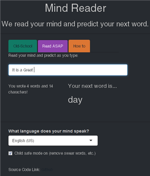

Mind Reader
========================================================
author: Shriram Gajjar
font-import: http://fonts.googleapis.com/css?family=Lato
font-family: 'Lato'
date: October 2016
transition: rotate
css: custom.css

This presentation is a pitch for an application a word prediction app for predicting the next word.
([Link to the Application](https://5hri.shinyapps.io/MindReader/))

Swiftkey-DS Coursera capstone project.

Creating the App
========================================================

The app lets the user type in the text an it predicts
the most likely next word, based on frequently
occurring phrases (n-grams).

__How was it created?__

2-grams to 5-grams were created from data that was
drawn from ~20,000 lines of English from blogs, news articles and Twitter.

Text was cleaned to remove things like punctuation (except apostrophes).
For further details, [click here](https://rpubs.com/shri/205775) 

* Clean data including removing curse words, punctuation, and digits
* Tokenize all input strings (separating sentences into individual words)
* Develop n-gram models
* Implemented stupid back off algorithm to expedite prediction

Navigating the App 
========================================================
__How to use the App?__

1. Type in the text box
2. The App analyzes the last few words
3. The App finds the most likely next word
4. The results are displayed

__Two modes of operation :__

1. Old-School mode: App waits until the "Read my mind" button is clicked to predict the next word.
2. Read ASAP mode: The App automatically displays the next predicte word.

* If user turns on
_Child safe mode_ the output word does not display profane results.

Algorithm used : Stupid Backoff
========================================================
Brants et al. developed the _Stupid Backoff_ algorithm.

* [Link to the paper.](http://www.aclweb.org/anthology/D07-1090.pdf)

This algorithm is computationally inexpensive and loads faster than Kneser-Ney smoothing.

The algo gives each candidate word a score, based on its n-gram frequency.

Mathematically, as shown below:

$Score = \begin{cases} \frac {freq(w_i)_{n=k+1}} {freq(w_{i-k}^{i-1})_{n=k+1}} & \text{if } freq(w_{i-k}^i)_{n=k+1} > 0 \\ \alpha \frac {freq(w_i)_{n=k}} {freq(w_{i-(k-1)}^{i-1})_{n=k}} & \text{otherwise} \end{cases}$

* The score depends on the Maximum Likelihood Estimate (MLE).

Additional information
========================================================

* The next word prediction app is hosted on [shinyapps.io](https://5hri.shinyapps.io/MindReader/)

* The whole code of this application, as well as all the milestone report, related scripts, this presentation etc. can be found in this  [GitHub repo.]( https://github.com/5hri/CapstoneProject)

* Other projects: [Click here.](https://sites.google.com/site/shriramgajjar/r-projects)

